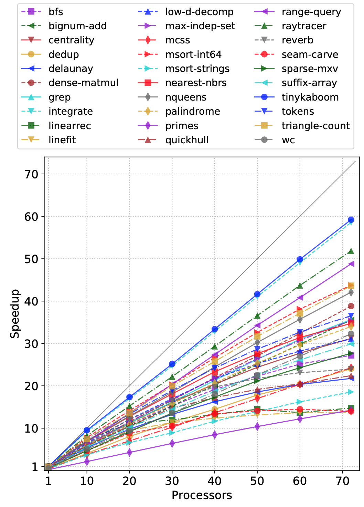
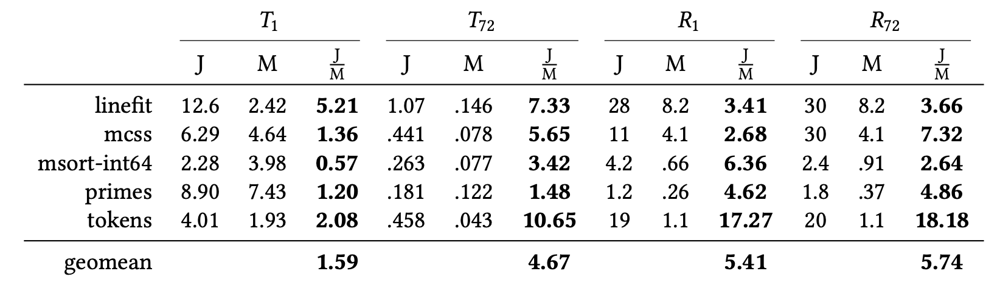

# parallel-ml-bench
Parallel ML benchmark suite for the [`mpl`](https://github.com/MPLLang/mpl)
compiler.

MaPLe (MPL) is an extension of the [MLton](http://mlton.org)
compiler for Standard ML which implements support for
nested (fork-join) parallelism. MPL generates executables with
excellent multicore performance, utilizing a novel approach to
memory management based on the theory of disentanglement
[[1](#rmab16),[2](#gwraf18),[3](#wyfa20),[4](#awa21)].
MPL is research software and is being actively developed.

This suite consists of sophisticated parallel benchmarks from various
problem domains, including graphs, text processing, digital audio processing,
image analysis and manipulation, numerical algorithms, computational
geometry, and others. These are ported to MPL from existing state-of-the-art
parallel C/C++ benchmark suites and libraries including
[PBBS](https://github.com/cmuparlay/pbbsbench),
[ParlayLib](https://github.com/cmuparlay/parlaylib),
[Ligra](https://github.com/jshun/ligra), and
[PAM](https://github.com/cmuparlay/PAM).
Even though these benchmarks were originally written in C/C++, all of them
are naturally disentangled.

All benchmarks are "problem-based", i.e., the input and output are
well-specified, allowing us to do cross-language comparisons.
This repo includes comparisons with Java, Go, Multicore OCaml, and C++.
We also compare against MLton (on which MPL is based) to determine overall
overheads and scalability.

## Sample of results

### Speedups
Speedup of MPL over MLton on up to 72 processors
across 30 benchmarks. This is on a 72-core server (4x 2.4GHz Intel E7-8867 v4
Xeons) with 1TB of memory.



### Java comparison
Comparison with Java on a few benchmarks, with runtimes $T_p$ (in seconds) and
space usage (maximum residency, in GB) $R_p$ on $p$ processors. Column $J/M$ is
the overhead of Java relative to MPL; higher ratios are better for MPL.



### Go comparison
Comparison with Go on a few benchmarks, with runtimes $T_p$ (in seconds) and
space usage $R_p$ (in GB) on $p$ processors. Column $G/M$ is the overhead of
Go relative to MPL; higher ratios are better for MPL.


## Requirements

Machine: Linux x86_64 multicore

Software requirements:
  * GCC version 9 (or later)
  * MLton version [20210117](https://github.com/MLton/mlton/releases/tag/on-20210117-release)
  * [mpl-switch](https://github.com/MPLLang/mpl-switch)
  * [smlpkg](https://github.com/diku-dk/smlpkg)
  * [jq](https://stedolan.github.io/jq/)
  * [numactl](https://github.com/numactl/numactl) (for C++, Java, Go experiments)
  * OCaml experiments only:
    - OCaml version `5.0.0+trunk`
    - [`opam`](https://github.com/ocaml/opam) version `2.1.0`
    - [`domainslib`](https://github.com/ocaml-multicore/domainslib) version `0.4.2`
    - [`dune`](https://github.com/ocaml/dune)
  * Java experiments only:
    - Java version 11
  * Go experiments only:
    - Go version 1.18

## Setup

First clone the repository:
```
$ git clone https://github.com/MPLLang/parallel-ml-bench
$ cd parallel-ml-bench
```

Then, run the init script. This should take approximately 15 minutes. It
installs all necessary  versions of `mpl` and generates inputs. Note that
the generated inputs require approximately 5GB of disk space.
```
$ ./init
```

## Run experiments

After completing the setup (described above), you can run all of the
experiments by passing a comma-separated list of processors to the `run`
script.

For example, here we run on 1, 4, and 8 processors:
```
$ ./run --procs 1,4,8
```

This command begins by compiling all of the benchmarks, and then runs each
one-by-one. **This will take a long time.** Depending on how many processors
you use, it could take multiple hours.

A progress indicator is printed at the beginning of each run which shows how
many commands are left to run. For example, `[5/100]` means that this is the
5th benchmark out of 100 total benchmarks to run.

Results are written to a timestamped file in the `results/` directory. The
timestamp format is `YYMMDD-HHMMSS`. Each line of a results file is a
JSON object with the parameters and results from that run.

You may terminate the `run` script early with `Ctrl-C`. All results obtained
so far will still be available in the results file.

## Generate report

After using the `run` script as described above, you can run the following
script to generate tables, speedup plots, etc. This will print out info at
the command line, and also generate data in the `figures/` directory.
```
$ ./report
```

## TODO

Infrastructure and benchmarks
  * [x] update inputs (need words256, input graphs, etc.)
  * [x] report script (speedup plots, summary table, etc.)
  * [ ] benchmarks documentation
  * [x] MPL: infrastructure
  * [x] MPL: benchmarks
  * [x] C++: infrastructure
  * [x] C++: **more benchmarks**
  * [x] Java: infrastructure
  * [ ] Java: **more benchmarks**
  * [x] OCaml: infrastructure
  * [x] OCaml: **more benchmarks**
  * [x] Go: infrastructure
  * [x] Go: **more benchmarks**

Performance optimization
  * [ ] Try z-sort for nearest neighbors.
  * [ ] Try leaf-based nearest neighbors. Would this improve performance
  for neighbors component of Delaunay, too?
  * [ ] Compare direction-optimizing BFS with C++ Ligra
  * [x] Check delayed-seq performance vs hand-optimized for delayed-seq
  benchmarks

## References

[<a name="rmab16">1</a>]
[Hierarchical Memory Management for Parallel Programs](http://cs.iit.edu/~smuller/papers/icfp16-preprint.pdf).
Ram Raghunathan, Stefan K. Muller, Umut A. Acar, and Guy Blelloch.
ICFP 2016.

[<a name="gwraf18">2</a>]
[Hierarchical Memory Management for Mutable State](http://www.cs.cmu.edu/~swestric/18/ppopp.pdf).
Adrien Guatto, Sam Westrick, Ram Raghunathan, Umut Acar, and Matthew Fluet.
PPoPP 2018.

[<a name="wyfa20">3</a>]
[Disentanglement in Nested-Parallel Programs](http://www.cs.cmu.edu/~swestric/20/popl-disentangled.pdf).
Sam Westrick, Rohan Yadav, Matthew Fluet, and Umut A. Acar.
POPL 2020.

[<a name="awa21">4</a>]
[Provably Space-Efficient Parallel Functional Programming](http://www.cs.cmu.edu/~swestric/21/popl.pdf).
Jatin Arora, Sam Westrick, and Umut A. Acar.
POPL 2021.
